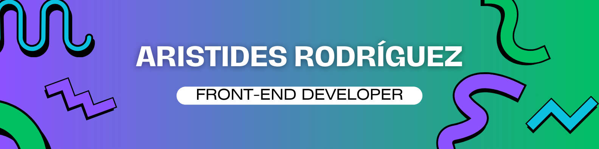

<!-- Visit counter ------------------------------------------------------------------------------------------------------------------------------------------------------->

# 
{ Hello World } 👋 I'm Aristides Rodríguez

## 👨🏻‍💻 About Me:

I am a young software developer with a great passion for programming and a strong desire to grow in my career. I love facing technical challenges and learning new technologies that allow me to create innovative solutions. I am committed to continued professional development and look forward to contributing to projects that help me expand my skills and knowledge in the software field.

 

  
    

## 💻 Tech Stack:

  
                   

## 📊 GitHub Stats:

  
   
  
  

 

 

## 🔝 Top Contributed Repo:

  

<!--**ArisRdz/ArisRdz** is a ✨ _special_ ✨ repository because its `README.md` (this file) appears on your GitHub profile.-->

