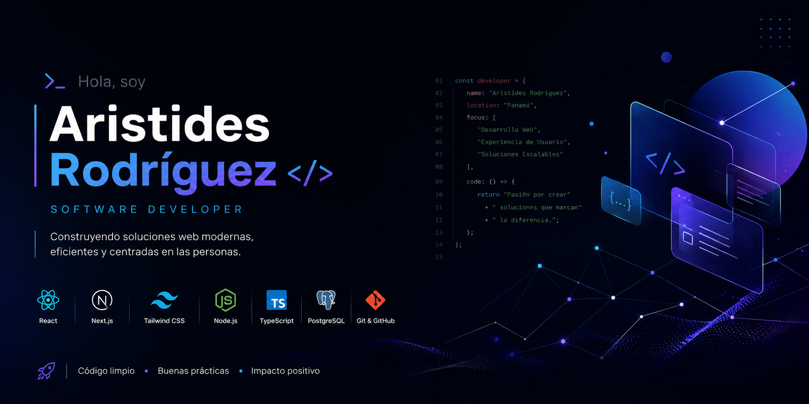

## 👨🏻‍💻 About Me

Software Developer from Panama focused on building modern, scalable, and user-centered web applications.

I enjoy transforming ideas into polished digital products by combining clean code, intuitive interfaces, and modern technologies. My main focus is web development with React, Next.js, and Tailwind CSS, while continuously learning and improving my skills through real-world projects.

 

&nbsp;&nbsp;

&nbsp;&nbsp;

 

## 💻 Tech Stack

### Frontend

### Backend, Data & APIs

### Tools

 

## 🚀 Featured Projects

| Project | Description |
|---|---|
| 🏃 **Hermes App** | Running calculator for training zones, pace, and heart rate analysis. |
| 💪 **MacroFit** | Web application to calculate personalized macronutrient goals. |
| 🌐 **Portfolio** | Personal developer portfolio built with Next.js and Tailwind CSS. |

<!--
| ✨ **Stellify** | Personalized constellation experience based on meaningful moments. |
| 📚 **Lecturify** | Digital library application powered by Google Books API. |
-->

 

## 📊 GitHub Stats

<table align="center">
<tr>

<td>

</td>

<td>

</td>

</tr>
</table>

